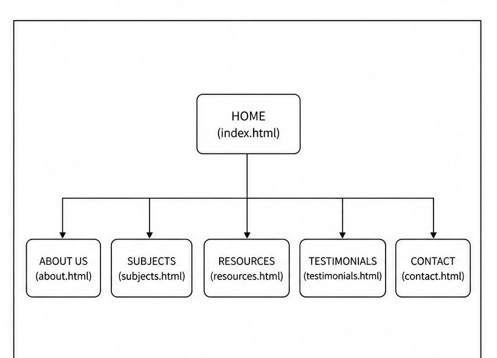
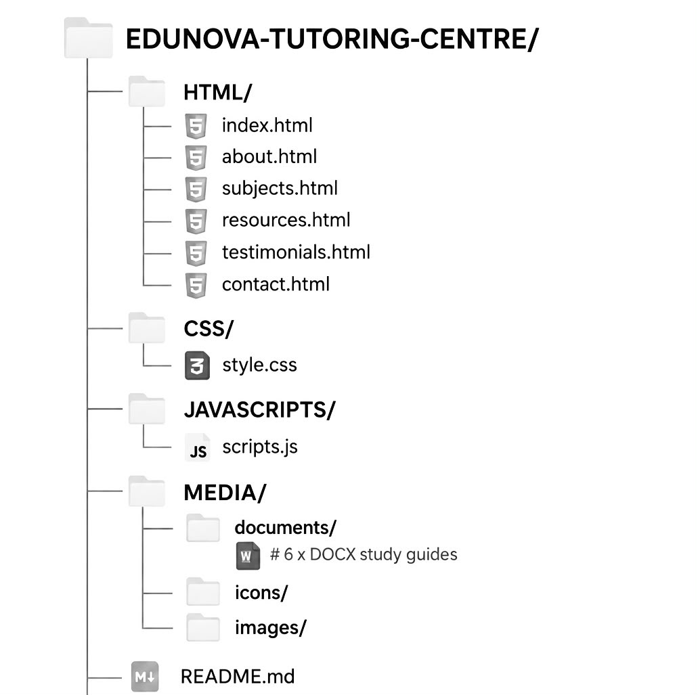

# edunova-part1
student name: libisi chantell

## project overview:
  
Organisation Name: EduNova Tutoring Centre  

### Organisation Background  

EduNova Tutoring Centre is a fictional tutoring centre that provides academic support to high school and university students. The organisation offers both online and face-to-face tutoring in subjects such as Mathematics, Physical Sciences, Accounting and English. Its aim is to help students improve their academic performance through personalised learning and experienced tutors.  

### Mission  

To provide affordable and accessible tutoring services that help students achieve their academic goals.  

### Vision   

To become a trusted tutoring centre known for academic excellence, quality teaching and student success.  

### Target Audience   

Grade 8–12 learners   

University students   

Parents looking for academic support for their children   

Adult learners requiring extra academic assistance  

## website goals and objectives 

### Goal   

The main goal of the website is to provide EduNova Tutoring Centre with a professional online platform where students and parents can learn about its services, access study resources and submit enquiries. The website will also follow basic Search Engine Optimisation (SEO) practices to improve its online visibility (Google Search Central, 2025). 

### Objectives 

* Promote the tutoring services offered.  

* Increase student enquiries through an online contact form. 

* Provide information about tutors and available subjects. 

* Share downloadable study resources. 

* Improve the organisation's online presence.

## key features and functionality

The website will include the following pages: 

* Home – Welcome message, hero banner and introduction. 

* About Us – Organisation background, mission, vision and tutor profiles. 

* Subjects – Information about all tutoring programmes.  

* Resources – Downloadable study guides and examination tips. 

* Testimonials – Reviews from students and parents. 

* Contact – Contact form, email address, phone number, business hours and location. 

### Additional Features 

* Responsive navigation menu. 

* JavaScript form validation (MDN Web Docs, 2025). 

* Frequently Asked Questions (FAQ). 

* Social media links. 

* Google Maps integration. 

* Search functionality.

## Timeline and Milestones

| Week   | Activity                          |
|--------|-----------------------------------|
| Week 1 | Research and planning             |
| Week 2 | Wireframe and website design      |
| Week 3 | HTML development                  |
| Week 4 | CSS styling                       |
| Week 5 | JavaScript implementation         |
| Week 6 | Testing and optimisation          |
| Week 7 | Final review and submission       |

## Part 1 Details

Part 1 focused on planning and designing the EduNova Tutoring Centre website. 
The following was completed:

- Website proposals
- Website wireframes
- Content research and sourcing
- File and folder organisation
- Website sitemap
- Project structure planning

## sitemap

## Changelog

| Date | Version | Changes |
|---|---|---|
| 31 July 2026 | v0.1 | Created the initial project structure and planned the website pages. |
| 5 August 2026 | v0.2 | Created the HTML files for the website pages and implemented the basic HTML structure. |
| 6 August 2026 | v0.3 | Added website content, navigation links and tested the pages to ensure they open and link correctly. |
| 6 August 2026 | v0.4 | Added CSS structure and prepared the website for further styling and development. |
| 8 August 2026 | v0.5 | Organised the project files and folders and prepared the GitHub repository. |

---

##  Part 1 Feedback & Changes Implemented
### Feedback Received:
1. Footer content was missing from all 6 HTML pages
2. Reference URLs were broken in the content-research document
3. Commits were mostly done in one sitting — need to spread across sessions

### Changes Made:
- [x] Added complete footer with organisation name, copyright notice, and Quick Links navigation to ALL 6 HTML pages (index, about, subjects, resources, testimonials, contact)
- [x] Fixed all reference URLs — updated README, proposal, and content-research document with identical, working links
- [x] Split work into multiple commits across separate sessions — see updated Changelog below
- [x] Verified CSS file links in every HTML page

---

##  File Structure
 

---

##  Part 2 — CSS & Responsive Design
### Features Implemented:
-  External `style.css` created and linked to ALL 6 HTML pages
-  Consistent base style: font family, colour scheme, reset for cross-browser consistency
-  Typography styling: `font-family`, `font-size`, `font-weight`, `line-height`, `letter-spacing`
-  Layout structure: Flexbox used for header, navigation, main content, footer
-  Visual styles: `color`, `background-color`, `border`, `box-shadow`, `border-radius`
-  Interactive states: `:hover`, `:active`, `:focus` for buttons and links
-  **Responsive Design — 3 Breakpoints via Media Queries:**
  -  **Desktop (1025px and up):** Full multi-column layout, horizontal navigation
  -  **Tablet (769px – 1024px):** Condensed layout, wrapped navigation
  -  **Mobile (768px and below):** Single column, stacked full-width navigation
-  **Relative units:** `rem` used throughout for scalable, accessible sizing
-  Responsive images: percentage widths + `height: auto` for all screen sizes

## Testing & Screenshots
Tested across 3 screen sizes with screenshots captured:
- **Desktop (1920×1080):** Full layout — navigation horizontal, content multi-column
- **Tablet (768×1024):** Navigation wraps, content adjusts, images scale
- **Mobile (375×667):** Single column, navigation stacked, full-width elements
- Browsers tested: Google Chrome, Microsoft Edge, Mozilla Firefox — consistent display and functionality

---

## Updated Changelog
| Date | Version | Changes |
|---|---|---|
| 31 July 2026 | v0.1 | Created the initial project structure and planned the website pages. |
| 5 August 2026 | v0.2 | Created the HTML files for the website pages and implemented the basic HTML structure. |
| 6 August 2026 | v0.3 | Added website content, navigation links and tested the pages to ensure they open and link correctly. |
| 6 August 2026 | v0.4 | Added CSS structure and prepared the website for further styling and development. |
| 8 August 2026 | v0.5 | Organised the project files and folders and prepared the GitHub repository. |
| 16 September 2026 | v1.0 — Part 2 | Added full footer (copyright + Quick Links) to all 6 HTML pages — addresses Part 1 feedback. |
| 16 September 2026 | v1.1 — Part 2 | Fixed all reference URLs — standardised across README, proposal, and content-research — addresses Part 1 feedback. |
| 16 September 2026 | v1.2 — Part 2 | Created external `style.css`, applied base styles, typography, colour palette, and Flexbox layout. |
| 16 September 2026 | v1.3 — Part 2 | Added media queries for tablet and mobile responsiveness; converted font sizes to `rem`. |
| 16 September 2026 | v1.4 — Part 2 | Added interactive hover/focus states, visual styling, downloadable document links to Resources page. |
| 16 September 2026 | v1.5 — Part 2 | Finalised README with testing notes, updated file structure, and complete reference list. |

---

## 🔗 Reference List

### Content & Sourcing
- Facebook (2026) Facebook. Available at: https://www.facebook.com/ [Accessed 6 August 2026].
- Instagram (2026) Instagram. Available at: https://www.instagram.com/ [Accessed 6 August 2026].
- LinkedIn (2026) LinkedIn. Available at: https://www.linkedin.com/ [Accessed 6 August 2026].
- Unsplash (2026) Unsplash License. Available at: https://unsplash.com/license [Accessed 6 August 2026].
- Pexels (2026) Pexels License. Available at: https://www.pexels.com/license [Accessed 6 August 2026].
- Google Fonts (2026) Google Fonts. Available at: https://fonts.google.com/ [Accessed 6 August 2026].
- Font Awesome (2026) Font Awesome Free License. Available at: https://fontawesome.com/license/free [Accessed 6 August 2026].
- Figma (2026) Figma. Available at: https://www.figma.com/ [Accessed 6 August 2026].
- GitHub (2026) GitHub Documentation. Available at: https://docs.github.com/ [Accessed 6 August 2026].
- W3Schools (2026) HTML Tutorial. Available at: https://www.w3schools.com/html/ [Accessed 6 August 2026].

### Technical Resources
- Google Search Central (2025) SEO Starter Guide. Available at: https://developers.google.com/search/docs/fundamentals/seo-starter-guide [Accessed 31 July 2026].
- MDN Web Docs (2025) CSS: Cascading Style Sheets. Available at: https://developer.mozilla.org/en-US/docs/Web/CSS [Accessed 31 July 2026].
- MDN Web Docs (2025) HTML: HyperText Markup Language. Available at: https://developer.mozilla.org/en-US/docs/Web/HTML [Accessed 31 July 2026].
- MDN Web Docs (2025) JavaScript Guide. Available at: https://developer.mozilla.org/en-US/docs/Web/JavaScript/Guide [Accessed 31 July 2026].
